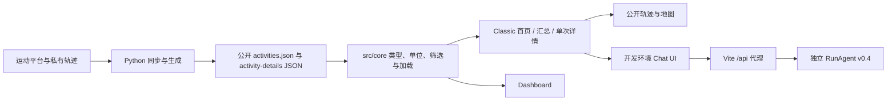

## Context

参见 [proposal.md](proposal.md)。2026-09-27 只读核查：生产站点的 Classic 首页采用黑底荧光黄、左侧大字号累计数字与地图/表格；`/summary` 是密集的月度卡片墙；`/activity/:id` 则已有更克制的深色训练报告、分段和四类曲线。源码中 Classic、Dashboard、详情各自定义颜色，详情使用蓝色强调，Classic 移动表格靠最小宽度与横向滚动。当前 `config.yml` 选 `classic`，Dashboard 仍是内置主题。CodeGraph 当前索引覆盖 161 个文件，`Activity` 的多个消费者与详情契约值得在改动前逐一影响分析。

前端是 React 19 / TypeScript 6 / Vite 8，Node 声明 `>=20`、pnpm 固定 8.9.0 且锁文件为 v6。CI 测 Node 20/22/24，Pages 用 Node 20，Docker 用 Node 18。Python 本地/项目要求 3.12+，CI 测 3.12–3.14，同步流程用 3.11，Docker 用 3.10；`pyproject.toml`、`requirements*.txt`、`uv.lock`、`pdm.lock` 入口并存。RunAgent v0.4 源码已有普通 Chat、`token/error` SSE、Agent 与有界进程内 Memory；前端仍只有开发环境 `/api/chat` UI。RunAgent 的集成文档部分仍描述 v0.2，应以当前控制器与 model 为准。

## Goals / Non-Goals

**Goals:**

- 为跑步记录建立能跨首页、汇总、详情、聊天和 Dashboard 复用的语义视觉系统，并以真实运动数据而非装饰性组件决定信息层级。
- 让筛选、统计、地图、详情使用一致的数据范围与单位，改善移动端、可访问性和失败状态。
- 对每个运行时与直接依赖给出“保留 / 升级 / 替换 / 移除”的依据、验证矩阵和回退办法；逐批升级，而非追逐版本号。
- 定义 RunAgent 现有接口与拟议生产契约的分界，使后续流式和 Agent 接入可以独立实施。

**Non-Goals:**

- 本变更不改 RunAgent Java 仓库、不自动开放生产聊天或引入新的认证体系。
- 不改写私有 `data.db`、原始 GPX/TCX/FIT、生成的真实 JSON/SVG，不修改每端 500 米裁剪及短轨迹回退规则。
- 不把 React 站点改成 Tauri、SSR 或带新业务后端的运行时应用。

## Decisions

### 1. 以“赛道记录册”统一视觉，而非引入通用管理后台组件库

设计解读：这是跑者的公开个人档案和训练记录，访客先看十年积累，再缩小到年度和单次训练。视觉采用石墨色/暖白两套底色、既有荧光黄作为操作与跑步数据的主要强调色，心率等曲线用有文字图例的受控辅助色。保留 IBM Plex Sans/Mono 与 Watson 标志；统一数字的等宽、单位、小数和中英文标签。首页减少大面积空白地图与重复 KPI，首屏以累计里程、时间跨度、今年进度和最近记录建立叙事；地图是记录探索的一种视图，加载失败有明确替代入口。汇总改为时间轴/周期比较的层级，详情沿用已有可读的训练报告结构并吸收统一 token。动效只服务于筛选、选中、导航和图表解释，尊重 reduced motion。

这借用 impeccable 的信息层级、完整状态与可访问性检查；taste-skill 的展示页原则只用于品牌首屏和叙事，不应用它的营销页 bento/CTA 模式处理记录表和统计。视觉设计参数建议：变化度 6、动效 3、信息密度 6；以真实浏览器迭代后固化。替代方案是全站换 shadcn/Radix 或复制详情页现有蓝色：前者带来大量组件和样式迁移，后者会丢失现有跑步标识，均缺少明确收益。

### 2. 保留静态数据链路，把展示变换集中在共享层



记录范围、单位、排序与缺失值语义优先用纯函数/Hook 放在 `src/core/`；Classic 专有地图和路由交互留在主题内。`Activity` 与 `ActivityDetail` 不通过 UI 猜测字段；任何导出字段调整都先核对 Python `Activity`、`ACTIVITY_KEYS`、生成器、两套 TS 类型和 TUI。复用现有 Recharts、地图及列表依赖，只有验证到兼容或可访问性缺陷且替代库有维护和体积优势时才更换。替代方案是全站从后端实时读活动：目前部署是静态站点，且 RunAgent 不持有发布数据的权威写入链路，因此会扩大隐私和可用性风险。

### 3. 扩展设计 token，保留两主题入口

建立共享的语义 token：`surface`、`surface-raised`、`text`、`muted`、`border`、`accent`、`focus`、`success`、`warning`、`chart-*`，明暗两套同时定义，映射旧 Classic/Dashboard 变量以分阶段迁移。token 必须经实际对比度检查；图表色系同时配标签、线型或图例，不靠颜色独自识别。字体远端加载失败时使用本地系统回退。交互状态统一覆盖 hover、focus、selected、disabled、loading、empty 和 error。地图失败时显示说明与记录列表，不以黑色空画布当作地图完成。替代方案是单次替换所有 CSS：当前 Classic 与 Dashboard 的全局样式相互独立，会使回归难以定位。

### 4. 依赖升级采用证据矩阵与兼容批次

在实施时生成一张直接依赖和运行环境清单，逐项记录当前声明版本、锁定版本、维护状态、官方支持矩阵、Node/Python 下限、安全公告、包体积/运行行为、决策和验证结果。先修执行环境：以项目要求的 Python 3.12 为最低路径，处理 Docker 3.10/Node 18 和同步 Workflow 3.11 的冲突；Node 24 作为首选构建环境，Pages 与 CI 的最低版本由真实依赖 `engines` 和部署支持确定。评估 pnpm 维护中的版本时连同 `packageManager`、lockfile、Corepack/Action 与冻结安装一起迁移；不独自更新其中一项。Python 需明确 `requirements*.txt`、`pyproject.toml`、`uv.lock`、`pdm.lock` 的权威入口与生成关系，尤其验证 `stravaweblib`/`stravalib` 的约束和平台专属包。React 19、Vite 8 等若官方支持和现有构建均良好，就保留当前主版本。

批次建议：A 运行时/安装链路，B 前端直接依赖，C Python 依赖，D 可移除或替换的库。每批独立核对冻结安装、类型/格式/测试/构建与适用 CI，记录回退到已验证锁文件的办法。外部 registry 当前未取得可靠的最新版本清单，不能把这些建议写成已验证的“最新版本”。替代方案是一次性全量升级：会把运行时、锁文件、地图、图表及生成器故障混在同一个回归面。

### 5. RunAgent 使用“现状 + 目标契约”双层表述

| 状态 | 接口 | 现场已验证的形状 | 前端计划 |
| --- | --- | --- | --- |
| 已接入开发环境 | `POST /api/chat` | `{message}` → `{content}`，问题最多 4000 字 | 保留单轮、内存态、60 秒超时和安全 Markdown，统一视觉 |
| 后端已实现，前端未接入 | `GET /api/chat/stream` | `message` 查询参数，SSE `token` / `error`，未见显式 complete 事件 | 只形成版本化 SSE 草案与终态/取消/错误测试样例 |
| 后端已实现，前端未接入 | `POST /api/agent` | `{conversationId?, message}` → `{conversationId, executionId, toolCallCount, content}` | 只形成版本化 Agent 草案、Memory/授权边界和最小化数据规则 |

后续生产契约的草案类型如下，名字与字段是**拟议 `/api/v1` 契约**，不是现有接口的声明或本次要启用的代码：

```ts
interface ChatRequestV1 { message: string }
interface ChatResponseV1 { requestId: string; content: string }
interface AgentRequestV1 { conversationId?: string; message: string }
interface AgentResponseV1 {
  conversationId: string;
  executionId: string;
  toolCallCount: number;
  content: string;
}
type StreamEventV1 =
  | { type: 'token'; requestId: string; sequence: number; content: string }
  | { type: 'complete'; requestId: string; sequence: number }
  | { type: 'error'; requestId: string; sequence: number; code: string; message: string };
```

生产接入前须由 RunAgent 端提供对称 Java record/事件 schema 与共享 fixtures，并明确认证、受限 CORS/同源代理、conversationId 作用域、重复事件和断线重连语义。当前 v0.4 Memory 只在 `/api/agent`、进程内、短期有界，conversationId 不是认证凭据；UI 不暗示永久记忆。现有 `/api/chat` 即使后端可以调用 Running Tool，前端也不能未经核实就宣称某次回答已读取个人记录。独立后端变更与生产发布须另行评审。

## Risks / Trade-offs

- [配色统一使旧 SVG/地图配色不协调] → 先把地图与图表语义色归入 token，并用亮暗、瓦片失败与隐私场景验收；不批量重生成 SVG。
- [新首页误读数据范围或个人最佳] → 让每个数字携带期间、单位与来源；用合成 fixture 对空值、跨年、运动类型和无轨迹活动做针对性验证。
- [依赖新版本改变 Node/Python 下限] → 先查官方兼容和锁文件 engines，分批安装/构建，并让 CI/Pages/Docker 目标一致后再移除旧版本。
- [触碰真实轨迹或生成资产造成隐私回归] → 本次 UI/依赖迁移使用合成数据与只读公开资产；任何真实数据再生成另列审核和发布步骤。
- [把后端新增接口误当作生产可用] → 在界面和文档中明确开发/生产边界，版本化契约、权限和部署就绪前不开放入口。

## Migration Plan

1. 保存当前 Classic、Dashboard、根路径/子路径、亮暗及窄屏的浏览器基线与关键指标；完成依赖决策表和 RunAgent v0.4 接口快照。
2. 先引入共享 token 与展示纯函数，保持旧变量兼容；按详情、首页、汇总、聊天、Dashboard 的顺序迁移并逐步删除重复样式。
3. 分批迁移工具链和依赖。每批保留可回退的锁文件/配置 diff；失败时只撤回该批，不触及公开数据。
4. 使用合成数据做功能与隐私回归；双主题、根/子路径构建，真实浏览器验证桌面/窄屏、亮暗、键盘/触摸、瓦片失败；部署验证另行记录，不能由本地构建替代。
5. RunAgent 只提交契约草案与前端界面改进；后端确认版本化接口和部署策略后，另一个变更再接入 Streaming Chat/Agent。

## Open Questions

- 是否把目前仅在开发环境出现的 RunAgent UI 迁到生产站点，取决于独立后端的域名、认证和部署方案；本设计保持当前生产静态边界。
- 在真实浏览器可测的机器上对照首页和详情的设计稿后，具体 token 数值与响应断点可在不改变上述行为契约的前提下微调。
